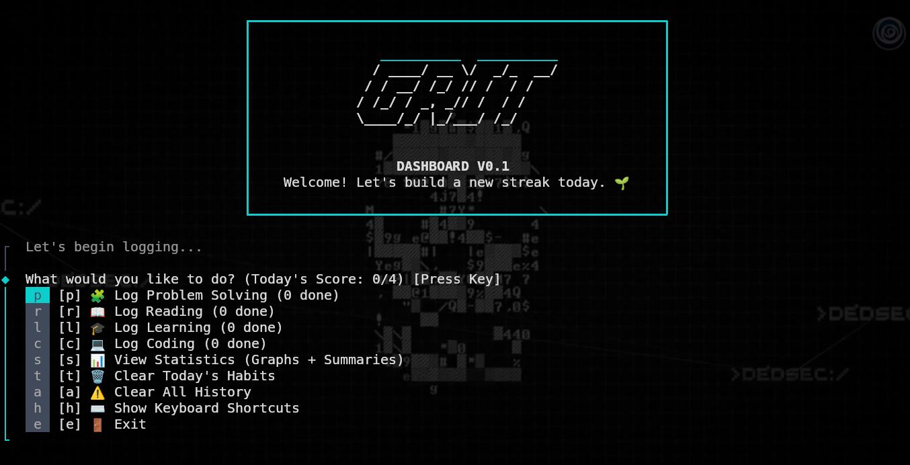
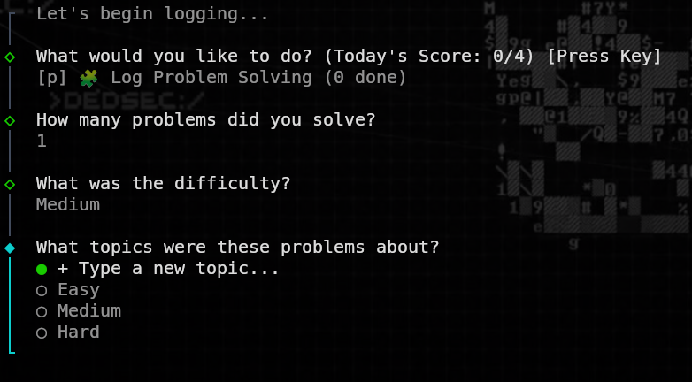
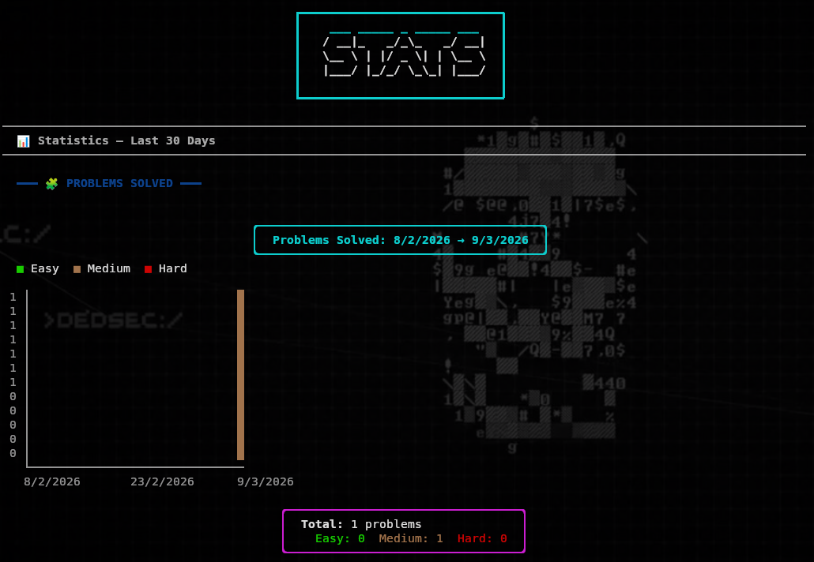
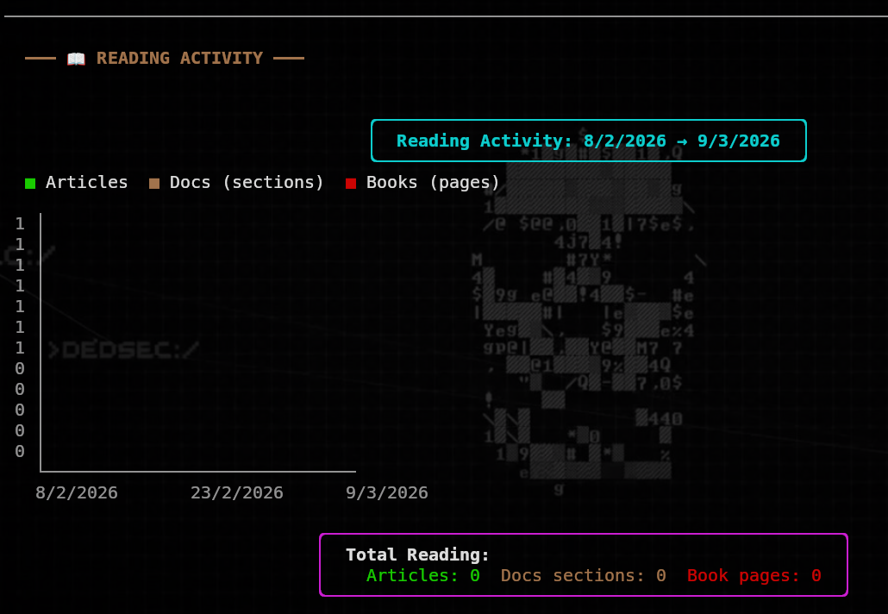
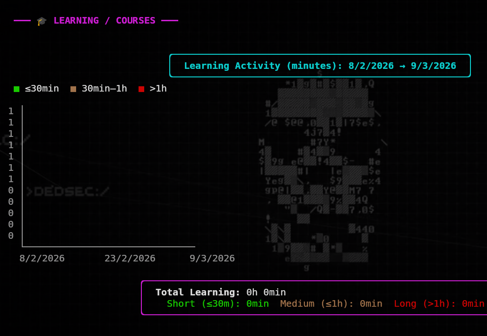
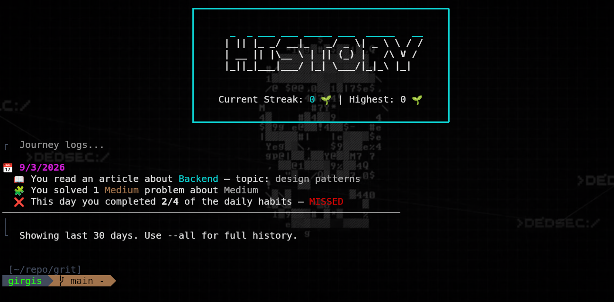

# grit

### it is CLI Tool for tracking you four most important hapits save them and do data analysis showing you you your performance 

you can install it using this command
```sh
npm i -g @garma-a/grit

```

#### The dahsboard  using `grit command`




### The Problem solving tracking system




### You can see graphs for the last 30 days



#### The same feature exists for the reading , building ,courses the 4 most important habits 





#### You can see every detail about your hapits formated by the date using `grit status`




#### if you want to see all the features and commands avilable you can use `grit --help`


